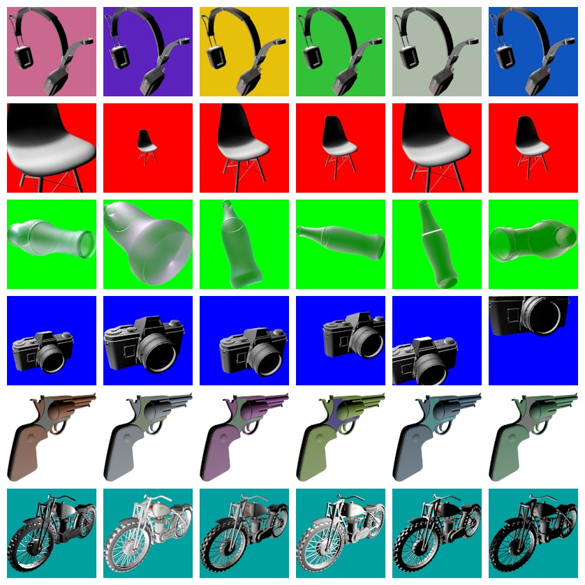
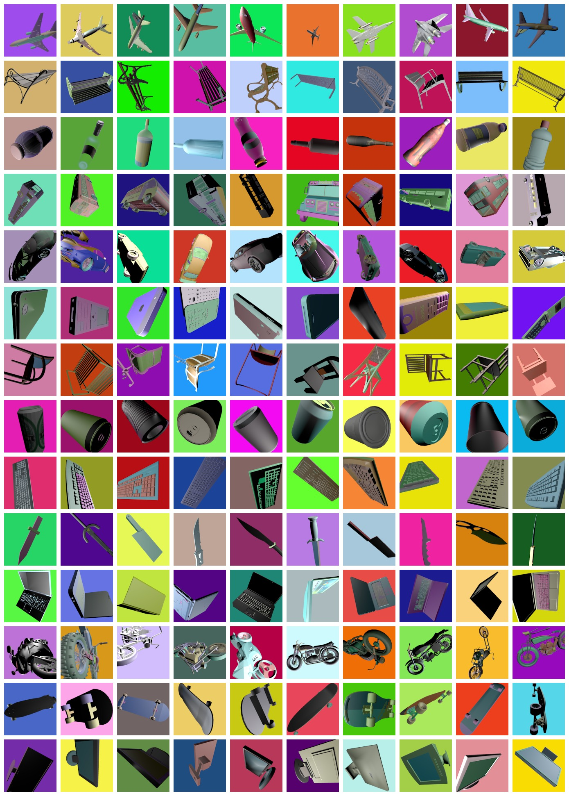
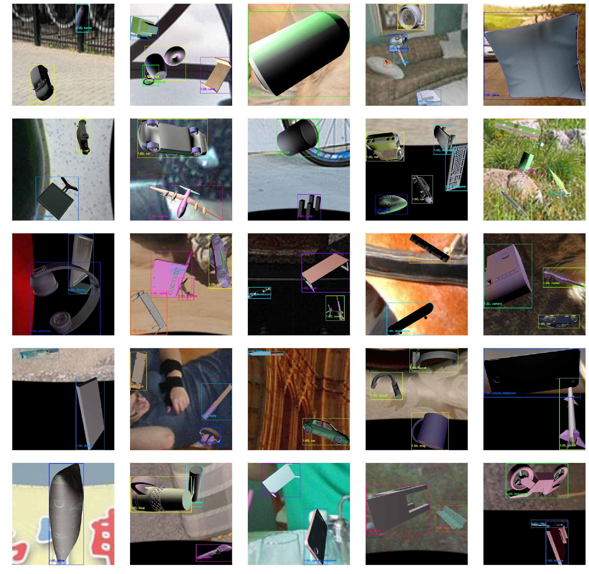

# beauvoir
Domain randomization library in Python for object detection and classification using Blender and ShapeNet.

## Random data augmentations:


## Generated classification examples:


## Generated object-detection examples:


## Requirements
* [Blender](https://www.blender.org/)
* [ShapeNet dataset](https://www.shapenet.org/)

The library is independet of ShapeNet but this dataset was taken as a use-case.


## Instructions
* Install requirements and download dataset
* For generating classification samples run:
```
blender -bP generate_classification_data.py
```

* For generating object-detection samples run:
```
blender -bP generate_detection_data.py
```
